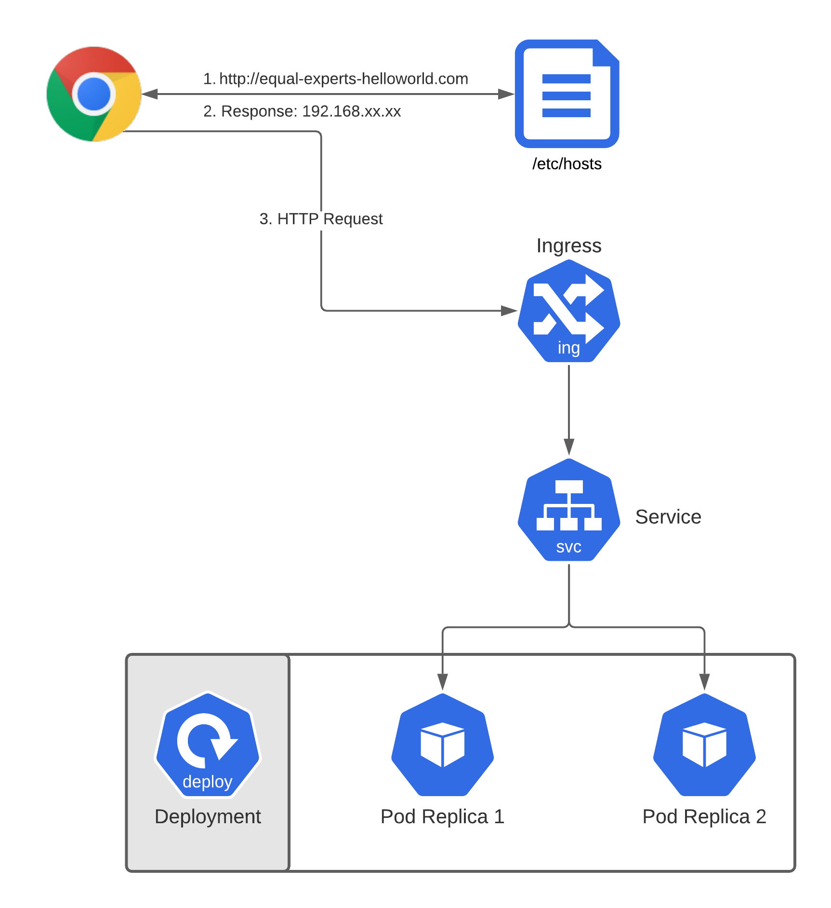

# Equal Experts Assignment

## By: Sohrab Khan
## Mob: 07944336953
## Email: sohrab@sohrabkhan.com


# Assignment Details
Assignment selected: Minikube
Detail:
Write a simple hello world application in any one of these languages: Python, Ruby, Go. Build the application within a Docker container and then load balance the application within minikube. You are not required to automate the installation of minikube on the host machine.

## Pre-requisites
Ensure you've the following installed:
* Helm CLI
* Kubectl CLI
* Minikube
* Docker

### Important
1. Get the IP address of minikube by running:
```
minikube ip
```

2. Add it your hosts file like below:
```
<IP ADDRESS>     equal-experts-helloworld.com
```

Note:
On Linux / Mac the hosts file is located at:
```
/etc/hosts
```

On Windows the hosts file is located at:
```
C:\Windows\System32\drivers\etc\hosts
```

## Installation
To install the supplied helm chart run the following command:
```
make install
```

To build the Docker image for the python app run the following command from the project root directory:
```
make build
```

To run the docker image locally without minikube run the following command:
```
make run
```

If you need any help run the following command:

```
make help
```

## Directory Structure
├── Makefile

├── README.md

├── app

│   ├── Dockerfile

│   ├── __init__.py

│   ├── main.py

│   ├── requirements.txt

│   └── uwsgi.ini

├── helloworld-chart

│   ├── Chart.yaml

│   ├── charts

│   ├── template.yaml

│   ├── templates

│   │   ├── NOTES.txt

│   │   ├── _helpers.tpl

│   │   ├── deployment.yaml

│   │   ├── hpa.yaml

│   │   ├── ingress.yaml

│   │   ├── service.yaml

│   │   ├── serviceaccount.yaml

│   │   └── tests

│   │       └── test-connection.yaml

│   └── values.yaml

### Makefile
A makefile has been provided which helps in running the most complex commands much easier.

### App/
This directory contains the Python Hellow World App

### Helloworld-chart
This directory contains the helm chart with Kubernetes resources


## Application
I chose to create the python web application using Flask framework because it's a very light weight and requires minimal
code to create a Python Web application.

A requirements.txt file is provided which helps in the installation of dependencies.

## Application Server
A production ready Python web application requires an application server. I've chosen uwsgi which is the recommended 
application server for Flask.

A uwsgi.ini file is provided in the app folder where I've set all the minimum necessary configuration that is required 
for serving the Flask application. 

## Docker Container
A Dockerfile is provided inside the app folder from which the Docker image is created. I've used python3.9 as the base 
image because I wanted to use the latest and greatest version of python and it's the official offering.

The build process copies the application to the /app folder in the image, set that folder as the workdir and then 
installs all dependencies found in the requirements.txt file.

As an entry point the "uswgi" application is used. 

For command arguments the `--ini uwsgi.ini` is used.


## Architecture
The architecture is kept as simple as possible but not compromising on DevOps principles and practices.

A Deployment Kubernetes resource is used for the application as the application is stateless. In case the application
was stateful we would have used Statefulset. A minimum of 2 replicas are used for the deployment which means that at a 
minimum 2 pods would be used to serve the application, thereby making the application highly available, scalable and 
more resiliant. A deployment update strategy of Rolling Update is used, which would mean that even during an update at 
the application should not experience any downtime.

To offer a production like experience we need a hosts entry to be set as explained in the pre-requisites section above.

A Kubernetes Ingress is used to 


## Helm Chart
A minimal helm chart is used for hosting the static application.  
